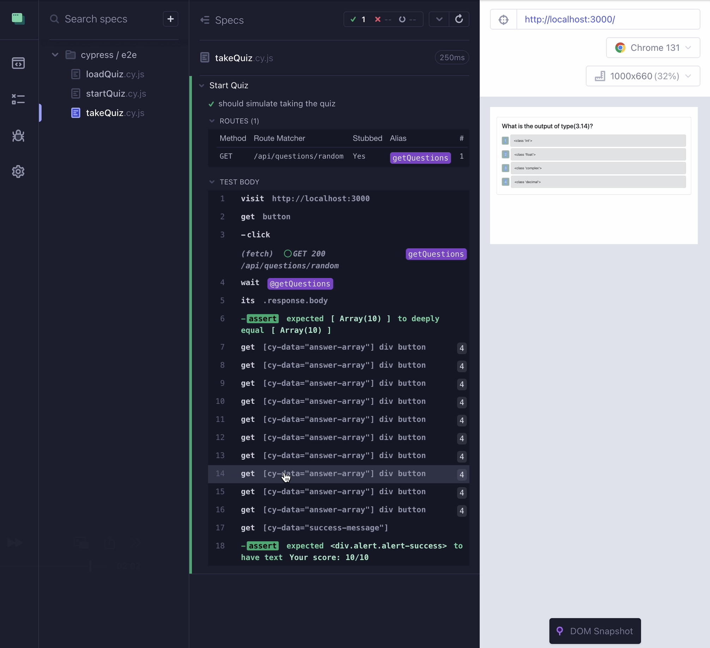

# Python Quiz Testing

## Description

This project was an exercise in taking an existing application and adding tests with Cypress. The existing application guides a user through a series of 10 random questions about Python, and then tells them their score. I wrote several component tests and end-to-end tests to ensure the application runs smoothly.

## Usage

[View a video demonstration here.](https://drive.google.com/file/d/1lWUISgS0t1qhETWWtB_nignBHVSM0PlI/view?usp=sharing)

The video walkthrough above shows me testing the application in Cypress.

## Credits

The existing code was provided by the full-stack coding bootcamp course through edX and the University of Minnesota. 

## License

This repository uses an [MIT License ↗️](./LICENSE.txt).
